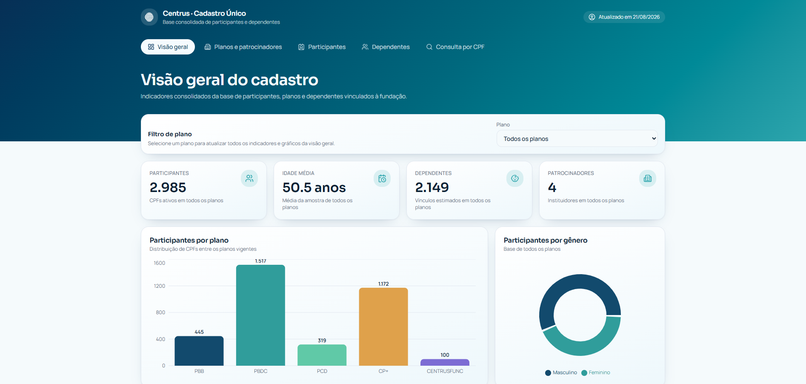
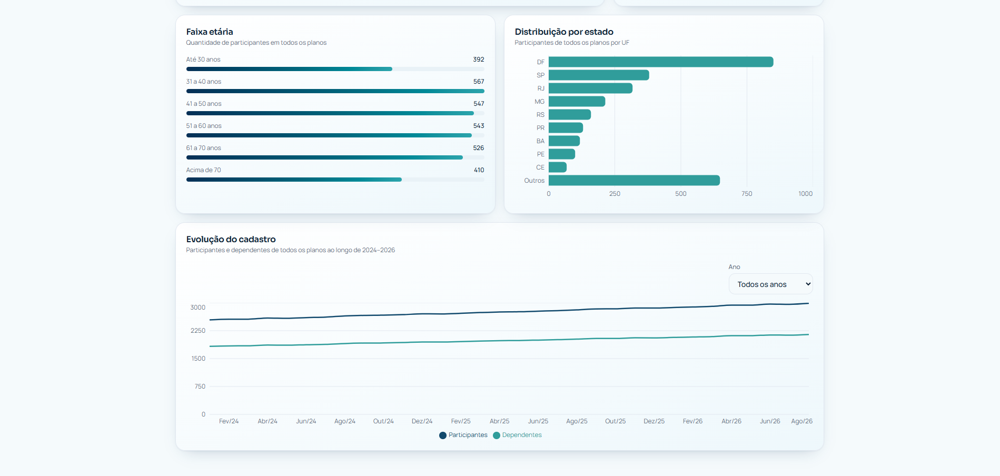
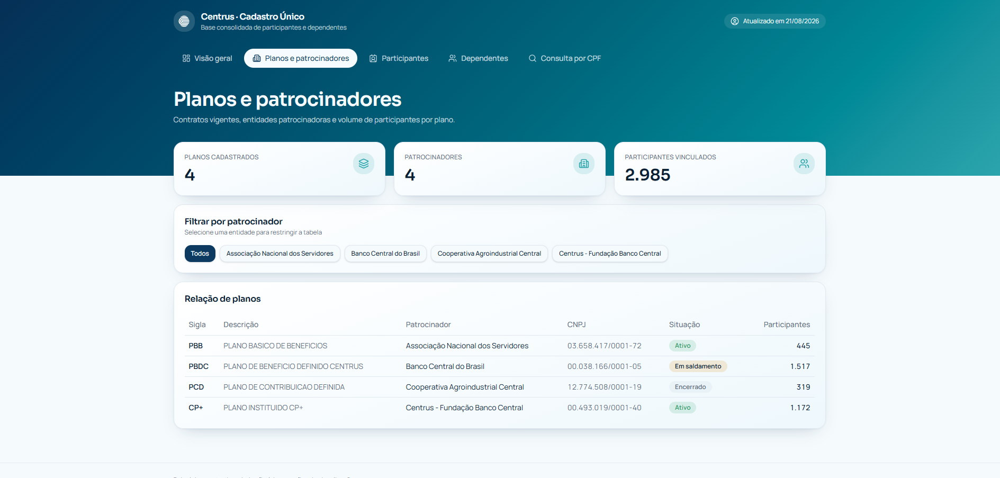
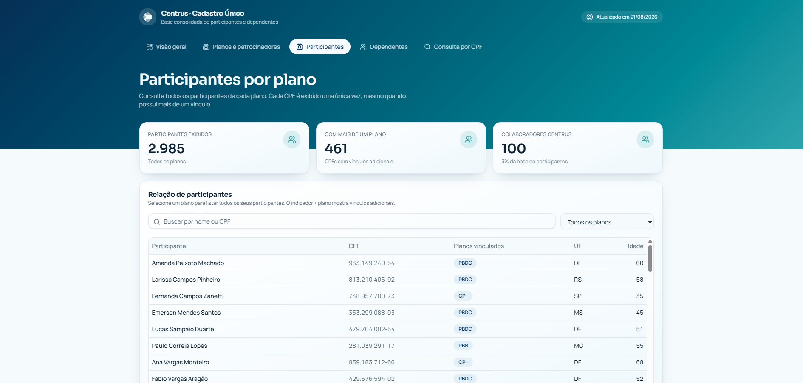
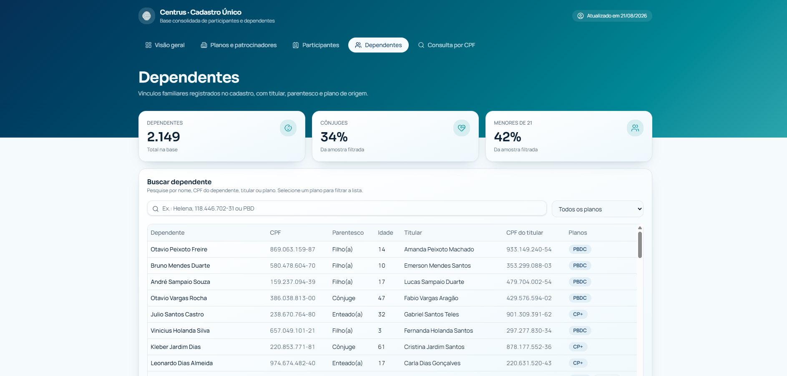
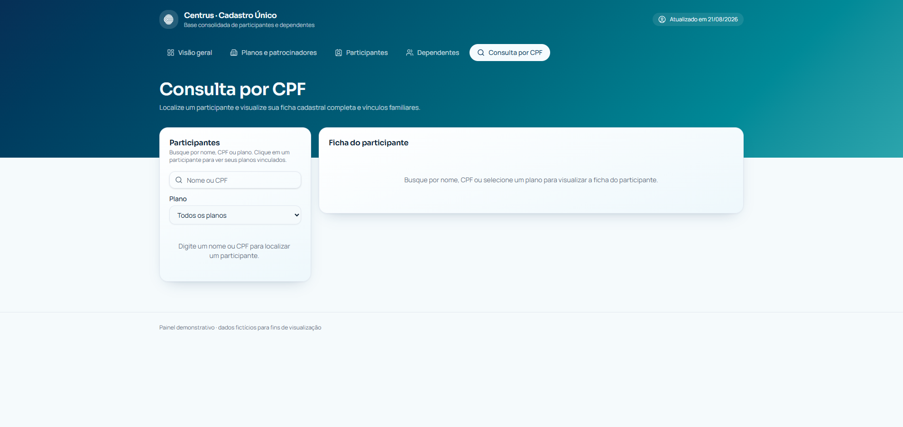
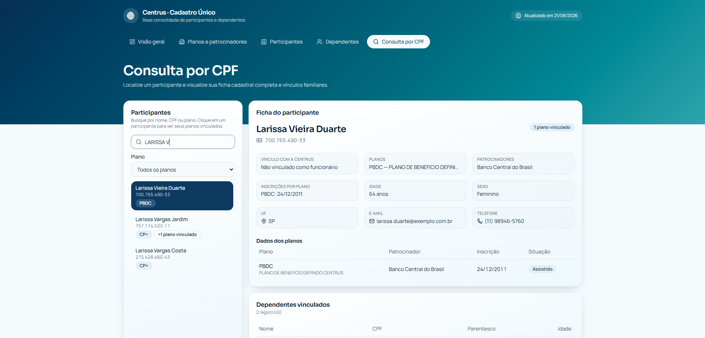
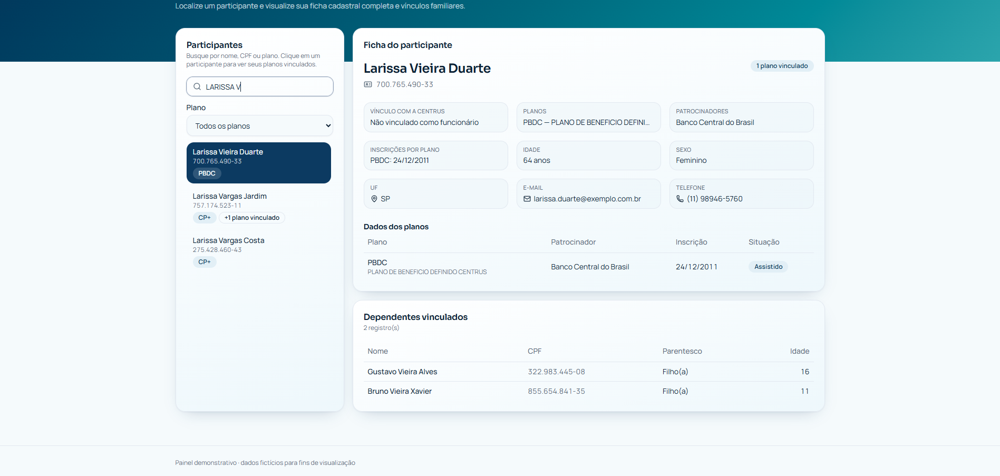

# Cadastro Único — Painel Centrus

Painel web que reproduz o relatório do Cadastro Único, com visão geral de participantes,
planos e patrocinadores, dependentes e consulta individual por CPF.

## Objetivo

Centralizar e facilitar a consulta dos dados cadastrais dos participantes, dependentes e
planos previdenciários, oferecendo uma visão consolidada que hoje está espalhada em
relatórios separados — reduzindo o tempo de busca e evitando erros de conferência manual.

## Funcionalidades básicas

- **Visão geral**: indicadores consolidados de participantes, dependentes, idade média,
  distribuição por gênero, faixa etária, estado e evolução no tempo.
- **Planos e patrocinadores**: tabela de planos com status e filtro por patrocinador.
- **Participantes**: listagem por plano, com identificação de CPFs com mais de um vínculo.
- **Dependentes**: busca por nome, CPF, titular ou plano, com grau de parentesco e idade.
- **Consulta por CPF**: busca de um participante específico por nome ou CPF, com ficha
  completa (dados de contato, planos vinculados, situação) e seus dependentes.

## Páginas

| Rota           | Descrição                                                                                                               |
| -------------- | ----------------------------------------------------------------------------------------------------------------------- |
| `/`            | Visão Geral: total de participantes, dependentes, idade média, distribuição por gênero, faixa etária, estado e evolução |
| `/planos`      | Planos + Patrocinador: tabela de planos com status e filtro por patrocinador                                            |
| `/dependentes` | Dependentes: busca por nome/CPF, grau de parentesco e idade                                                             |
| `/consulta`    | Consulta por CPF: ficha completa do participante e seus dependentes vinculados                                          |

## Capturas de tela

### Visão Geral




### Planos + Patrocinador



### Participantes



### Dependentes



### Consulta por CPF





## Executando localmente

É necessário ter o Node.js instalado ([instale com o nvm](https://github.com/nvm-sh/nvm#installing-and-updating)).

```sh
git clone <url-do-repositorio>
cd <nome-do-repositorio>
npm i
npm run dev
```

O aplicativo fica disponível em `http://localhost:8080`.

## Estrutura do projeto

```
src/
  routes/               páginas do painel (roteamento por arquivos)
  components/dashboard/ layout (Shell), cartões de indicador e painéis
  components/ui/        componentes de interface reutilizáveis
  data/cadastro.ts      base de dados do painel (participantes, planos, dependentes)
  styles.css            tokens de design: cores, tipografia e utilitários
```

## Identidade visual

- Paleta "Ocean Deep": azul-marinho `#0E4A6E` e verde-água `#2A9D9C`
- Tipografia: Sora (títulos) e Manrope (texto)
- Cartões com cantos arredondados e sombras suaves

Todas as cores são definidas como tokens semânticos em `src/styles.css`; evite cores fixas nos componentes.

## Tecnologias

- TanStack Start (React 19 + Vite)
- TypeScript
- Tailwind CSS
- Recharts (gráficos)

## Versão Power BI

O mesmo painel também está disponível em arquivo `.pbix`, com layout e tema equivalentes
ao desta versão web.

## Publicação

O projeto está configurado para publicação no GitHub Pages do repositório
`monnikys/cadastro-unico`. Ao enviar alterações para a branch `main`, o workflow
de GitHub Actions gera a versão estática e a publica automaticamente.

No GitHub, abra **Settings → Pages** e selecione **GitHub Actions** em
**Build and deployment**. A versão publicada ficará disponível em:

`https://monnikys.github.io/cadastro-unico/`
